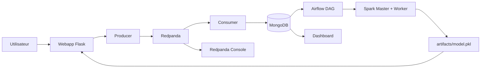

# Fraud Detection Platform

Plateforme simple de détection de fraude avec:
- une interface utilisateur Flask
- un broker Redpanda
- un cluster Spark standalone
- Airflow pour réentraîner le modèle toutes les 5 minutes
- MongoDB pour stocker les transactions réelles
- un dashboard live

## Schéma



## Structure

```text
.
├── airflow/               # Airflow + DAG de réentraînement
├── artifacts/             # model.pkl généré et partagé
├── consumer/              # lecture Kafka + mise à jour MongoDB
├── dashboard/             # vue live des transactions
├── producer/              # publication des transactions vers Redpanda
├── spark_trainer/         # job Spark qui entraîne le modèle
└── webapp/                # interface utilisateur et prédiction
```

## Ce qu’il faut savoir sur le modèle

- Le modèle est un `pickle` sérialisé dans `artifacts/model.pkl`.
- Il est réentraîné automatiquement par Airflow toutes les 5 minutes.
- Le job Spark lit les transactions déjà traitées dans MongoDB.
- Les variables utilisées sont:
  - `amount_fcfa`
  - `new_recipient`
  - `night_flag`
- La sortie est une probabilité de fraude calculée par régression logistique.
- `webapp` ne réentraîne jamais le modèle.
- Si `model.pkl` manque, l’application s’arrête au lieu d’inventer une prédiction.

## Lancer le projet

1. Démarrer toute la pile:

```bash
docker compose up --build
```

2. Ouvrir les interfaces:

```text
Webapp           http://localhost:5000
Dashboard        http://localhost:5001
Airflow UI       http://localhost:8080
Redpanda Console http://localhost:8084
Compass web      http://localhost:8089
```

## Accès Airflow

Airflow standalone affiche les identifiants au démarrage dans les logs.

Commande utile:

```bash
docker compose logs airflow
```

Tu y verras une ligne du type:

```text
Login with username: admin password: <mot_de_passe>
```

Ensuite:
- ouvre `http://localhost:8080`
- connecte-toi avec `admin`
- utilise le mot de passe affiché dans les logs

## Flux d’utilisation

1. L’utilisateur se connecte à la webapp.
2. Il saisit un transfert.
3. La webapp calcule un `fraud_score` avec `model.pkl`.
4. La transaction part vers Redpanda.
5. Le consumer applique les règles finales et écrit dans MongoDB.
6. Airflow relance le job Spark toutes les 5 minutes pour mettre à jour `model.pkl`.

## Comptes de démo

- `moussa` / `moussa123` avec PIN `1234`
- `binta` / `binta123` avec PIN `4321`

## Notes

- `webapp` lit seulement `artifacts/model.pkl`.
- Airflow est l’orchestrateur du réentraînement périodique.
- Redpanda Console sert à voir les topics, messages et consumers.
- Compass sert à explorer MongoDB.
- Tous les montants sont en FCFA.

## Si tu effaces MongoDB

- Les comptes et l’historique disparaissent.
- Le consumer recrée les comptes de démo au besoin.
- `webapp` continue à fonctionner si `artifacts/model.pkl` existe déjà.
- Le réentraînement Airflow/Spark ne pourra pas se faire tant qu’il n’y a pas de nouvelles transactions labellisées dans MongoDB.
- Si tu supprimes aussi `artifacts/model.pkl`, la webapp ne pourra plus démarrer tant qu’un nouveau modèle n’aura pas été réentraîné.
